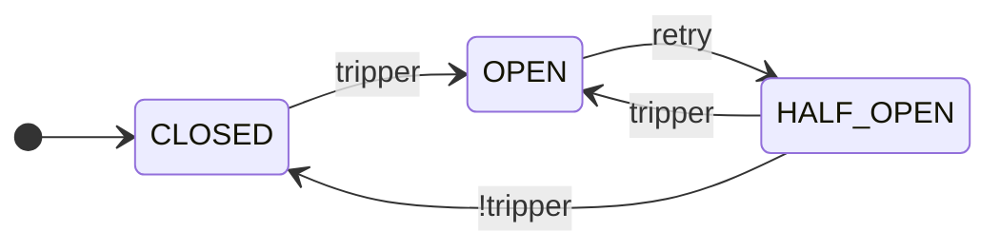

<h1 align="center">Fluxgate</h1>

<p align="center">
  <a href="https://github.com/byExist/fluxgate/actions/workflows/ci.yml"></a>
  <a href="https://pypi.org/project/fluxgate/"></a>
  <a href="https://pypi.org/project/fluxgate/"></a>
  <a href="https://github.com/byExist/fluxgate/blob/master/LICENSE"></a>
</p>

<p align="center">
  동기와 비동기를 모두 first-class로 지원하는 조합 가능한 Python <b>circuit breaker</b> 라이브러리.
</p>

<p align="center">
  <a href="README.md">English</a> | <b>한국어</b>
</p>

---

## 왜 Fluxgate인가?

Circuit breaker는 서비스 상태를 모니터링하고 실패하는 의존 서비스 호출을 일시적으로 차단하여 연쇄적인 장애를 방지합니다. 대부분의 Python 라이브러리는 **연속 실패** 기준으로 회로를 여는데, 간헐적인 에러가 있는 서비스에는 취약합니다. Fluxgate는 **슬라이딩 윈도우 기반 실패율**로 회로를 열며, 규칙은 직접 조합할 수 있는 first-class value입니다.

```python
from fluxgate import CircuitBreaker
from fluxgate.trippers import MinRequests, FailureRate, SlowRate, FailureStreak

cb = CircuitBreaker(
    tripper=FailureStreak(5) | (MinRequests(20) & (
        FailureRate(0.5) | SlowRate(0.3, threshold=1.0)
    )),
)
```

> **참고:** 상태는 프로세스 로컬이며 스레드 안전하지 않습니다. 동시성이 필요하면 스레드 대신 `asyncio` + `AsyncCircuitBreaker`를 사용하세요.

## 설치

```bash
pip install fluxgate                  # 코어, 의존성 없음
pip install "fluxgate[prometheus]"    # +PrometheusListener
pip install "fluxgate[slack]"         # +SlackListener
```

## 사용법

```python
import httpx
from fluxgate import AsyncCircuitBreaker
from fluxgate.trackers import TypeOf

cb = AsyncCircuitBreaker(
    tracker=TypeOf(httpx.ConnectError, httpx.TimeoutException),
    max_half_open_calls=10,
)

@cb
async def fetch(url):
    async with httpx.AsyncClient() as client:
        return (await client.get(url)).json()
```

`CircuitBreaker`가 동기 코드용 동일 인터페이스를 제공합니다. 회로가 열린 상태에서는 즉시 `CallNotPermittedError`가 발생하며, `@cb(fallback=...)`을 지정하면 graceful degradation이 가능합니다.

## 동작 방식

Fluxgate는 상태 머신입니다. 핵심 사이클은 CLOSED → OPEN → HALF_OPEN입니다.



세 가지 추가 상태(`metrics_only`, `disabled`, `forced_open`)는 [운영 제어](#운영-제어) 섹션에서 다룹니다.

## 조합 가능한 규칙

모든 조건은 값이며 `&` / `|` 로 조합됩니다.

```python
from fluxgate.trippers import (
    Closed, HalfOpened, MinRequests, FailureRate, SlowRate, FailureStreak,
)

# 상태별 규칙: 복구를 확인할 때는 더 엄격하게.
tripper = FailureStreak(5) | (MinRequests(20) & (
    (Closed()    & (FailureRate(0.5) | SlowRate(0.3, threshold=1.0))) |
    (HalfOpened() & (FailureRate(0.3) | SlowRate(0.2, threshold=1.0)))
))
```

`Tracker`(실패 분류)도 같은 패턴을 따르며 `&` / `|` / `~` 로 조합됩니다.

## 컴포넌트

| 컴포넌트 | 역할 | 예시 |
|----------|------|------|
| `Window` | 최근 호출 추적 (건수 또는 시간 기반) | `CountWindow(100)`, `TimeWindow(60)` |
| `Tracker` | 어떤 예외를 실패로 카운트할지 분류 | `All()`, `TypeOf(HTTPError)`, `Custom(func)`; `&` / `\|` / `~` 로 조합 |
| `Tripper` | 회로를 언제 열지 결정 | `MinRequests`, `FailureRate`, `SlowRate`, `AvgLatency`, `FailureStreak`, `Closed`/`HalfOpened`; `&` / `\|` 로 조합 |
| `Retry` | `OPEN → HALF_OPEN` 전환 트리거 | `Cooldown`, `Backoff`, `Always`, `Never` |
| `Permit` | `HALF_OPEN` 상태에서 호출 허용 | `All`, `Random(ratio)`, `RampUp(initial, final, duration)` |
| `Listener` | 상태 전환에 반응 | `LogListener`, `PrometheusListener`, `SlackListener` |

모든 컴포넌트는 입력 검증을 포함한 추상 기본 클래스(`abc.ABC`)입니다 — 잘못된 설정은 생성 시점에 즉시 실패합니다. 직접 컴포넌트를 작성하려면 상속하세요.

## 운영 제어

자동 회로 오픈 외에도, 안전한 롤아웃과 수동 제어를 위한 훅이 있습니다.

- **`cb.metrics_only()`** — 섀도우 모드: 회로를 열지 않고 메트릭만 수집합니다. 실제 적용 전 임계값을 검증할 때 유용합니다.
- **`cb.force_open()`** / **`cb.disable()`** — 장애 대응이나 유지보수 중의 수동 오버라이드.
- **`cb.info()`** — 현재 상태, 메트릭, 재오픈 횟수의 스냅샷.
- **`cb.reset()`** — CLOSED로 복귀하고 메트릭을 초기화합니다.

## 모니터링

`listeners=...` 옵션으로 리스너를 전달하세요 — 내장: `LogListener`, `PrometheusListener` (옵션), `SlackListener` (옵션). 각 리스너는 로그/Prometheus 라벨/Slack 메시지에서 사용되는 `name=` 식별자를 받습니다. 상태 전환은 `Signal` 이벤트를 발생시키며, `AsyncCircuitBreaker`는 `AsyncListener`도 받습니다.

## 문서

- [전체 문서](https://byExist.github.io/fluxgate/latest/) — 개념, 컴포넌트, 예제, API 레퍼런스
- [다른 라이브러리와의 비교](https://byExist.github.io/fluxgate/latest/about/comparison/) — `pybreaker`, `circuitbreaker`, `aiobreaker`와 비교
- [체인지로그](https://byExist.github.io/fluxgate/latest/changelog/) — 버전 기록 및 마이그레이션 가이드

## 개발

```bash
uv sync --all-extras --all-groups
uv run pytest
```
