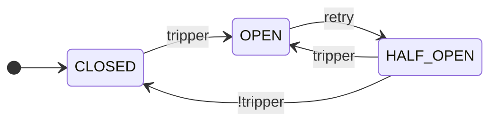

<h1 align="center">Fluxgate</h1>

<p align="center">
  <a href="https://github.com/byExist/fluxgate/actions/workflows/ci.yml"></a>
  <a href="https://pypi.org/project/fluxgate/"></a>
  <a href="https://pypi.org/project/fluxgate/"></a>
  <a href="https://github.com/byExist/fluxgate/blob/master/LICENSE"></a>
</p>

<p align="center">
  슬라이딩 윈도우 기반 실패율·지연·연속 실패 규칙을 조합 가능한 <b>Python circuit breaker 라이브러리</b>.
</p>

<p align="center">
  <a href="README.md">English</a>
</p>

---

## 왜 Fluxgate인가?

Circuit breaker는 실패하는 의존 서비스로의 호출을 일시적으로 차단해 연쇄 장애를 막습니다. 기존 Python circuit breaker 대부분은 **연속 실패 횟수**로 회로를 여는데, 이는 취약합니다. 서비스가 여전히 불안정해도 한 번의 성공으로 카운터가 초기화되기 때문입니다.

Fluxgate는 **슬라이딩 윈도우 기반 실패율**로 회로를 엽니다 — Java 진영의 [Resilience4j](https://resilience4j.readme.io/)가 검증한 접근 방식과 동일합니다 — 그리고 **지연 기반 트리거**, **조합 가능한 규칙**(`&` / `|`), **점진적 복구**(`RampUp`)를 지원합니다. `CircuitBreaker`(동기)와 `AsyncCircuitBreaker`(비동기) 모두 first-class입니다.

> **참고:** 상태는 프로세스 로컬이며 스레드 안전하지 않습니다. 동시성이 필요하면 스레드 대신 `asyncio` + `AsyncCircuitBreaker`를 사용하세요.

## 설치

```bash
pip install fluxgate                  # 코어, 의존성 없음
pip install "fluxgate[prometheus]"    # +PrometheusListener
pip install "fluxgate[slack]"         # +SlackListener
```

## 사용법

```python
import httpx
from fluxgate import AsyncCircuitBreaker
from fluxgate.windows import TimeWindow
from fluxgate.trackers import TypeOf
from fluxgate.trippers import MinRequests, FailureRate, SlowRate, FailureStreak
from fluxgate.retries import Backoff
from fluxgate.permits import RampUp
from fluxgate.listeners.log import LogListener

# 외부 결제 API 호출을 보호합니다.
payments_cb = AsyncCircuitBreaker(
    window=TimeWindow(size=60),                            # 60초 슬라이딩 윈도우
    tracker=TypeOf(httpx.HTTPError),                       # HTTP/네트워크 에러만 실패로 카운트
    tripper=FailureStreak(5) | (                           # 연속 5회 실패 시 즉시 오픈,
        MinRequests(20) & (                                # 또는 윈도우 내 20+ 요청 기준:
            FailureRate(0.5) |                             #   실패율이 50% 초과거나
            SlowRate(0.3, threshold=1.0)                   #   30% 이상이 1초보다 느리면 오픈
        )
    ),
    retry=Backoff(initial=10.0, max_duration=600.0),       # 재시도까지 지수 백오프
    permit=RampUp(initial=0.1, final=1.0, duration=60.0),  # 복구 트래픽을 60초간 10% → 100%로 증가
    listeners=[LogListener(name="payments-api")],          # 상태 전환마다 로깅
)


@payments_cb
async def check_payment_status(payment_id: str) -> dict:
    async with httpx.AsyncClient(timeout=2.0) as client:
        response = await client.get(f"https://api.example.com/payments/{payment_id}")
        response.raise_for_status()
        return response.json()
```

동기 코드에는 `CircuitBreaker`가 동일한 설정 방식을 제공합니다. 회로가 열린 상태에서는 `CallNotPermittedError`가 발생하며, 호출자는 `try`/`except`나 데코레이터의 `fallback=` 인자로 이를 처리할 수 있습니다.

## 동작 방식

Fluxgate는 상태 머신입니다. 핵심 사이클은 CLOSED → OPEN → HALF_OPEN입니다.



세 가지 추가 상태(`metrics_only`, `disabled`, `forced_open`)는 [운영 제어](#운영-제어) 섹션에서 다룹니다.

## 컴포넌트

| 컴포넌트 | 지원 연산자 | 역할 | 예시 |
|----------|-------------|------|------|
| `Window` | — | 최근 호출 추적 (건수 또는 시간 기반) | `CountWindow(100)`, `TimeWindow(60)` |
| `Tracker` | `&` `\|` `~` | 어떤 예외를 실패로 카운트할지 분류 | `All()`, `TypeOf(HTTPError)`, `Custom(func)` |
| `Tripper` | `&` `\|` | 회로를 언제 열지 결정 | `MinRequests`, `FailureRate`, `SlowRate`, `AvgLatency`, `FailureStreak`, `Closed`/`HalfOpened` |
| `Retry` | — | `OPEN → HALF_OPEN` 전환 트리거 | `Cooldown`, `Backoff`, `Always`, `Never` |
| `Permit` | — | `HALF_OPEN` 상태에서 호출 허용 | `All`, `Random(ratio)`, `RampUp(initial, final, duration)` |
| `Listener` | — | 상태 전환에 반응 | `LogListener`, `PrometheusListener`, `SlackListener` |

`Window`, `Tracker`, `Tripper`, `Retry`, `Permit`는 입력 검증을 포함한 추상 기본 클래스(`abc.ABC`)입니다 — 잘못된 설정은 생성 시점에 즉시 실패합니다. 직접 만들려면 상속하세요.

`Listener`와 `AsyncListener`는 사용자 정의 함수나 타입을 위해 `Protocol`로 정의되어 있습니다.

## 운영 제어

자동 회로 오픈 외에도, 안전한 롤아웃과 수동 제어를 위한 훅이 있습니다.

- **`cb.metrics_only()`** — 섀도우 모드: 회로를 열지 않고 메트릭만 수집합니다. 실제 적용 전 임계값을 검증할 때 유용합니다.
- **`cb.force_open()`** / **`cb.disable()`** — 장애 대응이나 유지보수 중의 수동 오버라이드.
- **`cb.info()`** — 현재 상태, 메트릭, 재오픈 횟수의 스냅샷.
- **`cb.reset()`** — CLOSED로 복귀하고 메트릭을 초기화합니다.

## 문서

- [전체 문서](https://byExist.github.io/fluxgate/latest/) — 개념, 컴포넌트, 예제, API 레퍼런스
- [라이브러리 비교](https://byExist.github.io/fluxgate/latest/about/comparison/) — 다른 Python circuit breaker와의 설계 트레이드오프
- [체인지로그](https://byExist.github.io/fluxgate/latest/changelog/) — 버전 기록 및 마이그레이션 가이드

## 개발

```bash
uv sync --all-extras --all-groups
uv run pytest
```
