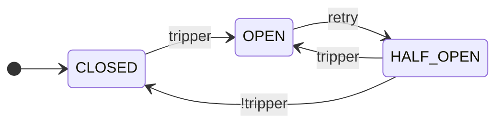

<h1 align="center">Fluxgate</h1>

<p align="center">
  <a href="https://github.com/byExist/fluxgate/actions/workflows/ci.yml"></a>
  <a href="https://pypi.org/project/fluxgate/"></a>
  <a href="https://pypi.org/project/fluxgate/"></a>
  <a href="https://github.com/byExist/fluxgate/blob/master/LICENSE"></a>
</p>

<p align="center">
  A composable <b>circuit breaker</b> library for Python with first-class sync and async support.
</p>

<p align="center">
  <b>English</b> | <a href="README.ko.md">한국어</a>
</p>

---

## Why Fluxgate?

Circuit breakers prevent cascading failures by monitoring service health and temporarily blocking calls to failing dependencies. Most Python libraries trip on **consecutive failures** — brittle for any service with intermittent errors. Fluxgate trips on **failure rates over a sliding window**, and rules are first-class values you compose:

```python
from fluxgate import CircuitBreaker
from fluxgate.trippers import MinRequests, FailureRate, SlowRate, FailureStreak

cb = CircuitBreaker(
    name="payment_api",
    tripper=FailureStreak(5) | (MinRequests(20) & (
        FailureRate(0.5) | SlowRate(0.3, threshold=1.0)
    )),
)
```

> **Note:** State is process-local and not thread-safe. For concurrency, use `asyncio` + `AsyncCircuitBreaker`, not threading.

## Installation

```bash
pip install fluxgate                  # core, zero dependencies
pip install "fluxgate[prometheus]"    # +PrometheusListener
pip install "fluxgate[slack]"         # +SlackListener
```

## Usage

```python
import httpx
from fluxgate import AsyncCircuitBreaker
from fluxgate.trackers import TypeOf

cb = AsyncCircuitBreaker(
    name="api",
    tracker=TypeOf(httpx.ConnectError, httpx.TimeoutException),
    max_half_open_calls=10,
)

@cb
async def fetch(url):
    async with httpx.AsyncClient() as client:
        return (await client.get(url)).json()
```

`CircuitBreaker` mirrors this API for sync code. A tripped circuit raises `CallNotPermittedError`; pass `@cb(fallback=...)` to fall back gracefully.

## How It Works

Fluxgate is a state machine. The core cycle is CLOSED → OPEN → HALF_OPEN:



Three additional states (`METRICS_ONLY`, `DISABLED`, `FORCED_OPEN`) are documented in [Operational Controls](#operational-controls).

## Composable Rules

Every condition is a value and combines with `&` / `|`:

```python
from fluxgate.trippers import (
    Closed, HalfOpened, MinRequests, FailureRate, SlowRate, FailureStreak,
)

# State-specific rules: stricter when probing recovery.
tripper = FailureStreak(5) | (MinRequests(20) & (
    (Closed()    & (FailureRate(0.5) | SlowRate(0.3, threshold=1.0))) |
    (HalfOpened() & (FailureRate(0.3) | SlowRate(0.2, threshold=1.0)))
))
```

`Tracker` (failure classification) follows the same pattern with `&` / `|` / `~`.

## Components

| Component | Role | Examples |
|-----------|------|----------|
| `Window` | Track recent calls (count- or time-based) | `CountWindow(100)`, `TimeWindow(60)` |
| `Tracker` | Classify which exceptions count as failures | `All()`, `TypeOf(HTTPError)`, `Custom(fn)`; combine with `&` / `\|` / `~` |
| `Tripper` | Decide when to open the circuit | `MinRequests`, `FailureRate`, `SlowRate`, `AvgLatency`, `FailureStreak`, `Closed`/`HalfOpened`; combine with `&` / `\|` |
| `Retry` | Trigger `OPEN → HALF_OPEN` | `Cooldown`, `Backoff`, `Always`, `Never` |
| `Permit` | Admit calls in `HALF_OPEN` | `All`, `Random(p)`, `RampUp(start, end, duration)` |
| `Listener` | React to state transitions | `LogListener`, `PrometheusListener`, `SlackListener` |

All components are abstract base classes (`abc.ABC`) with input validation — misconfigurations fail fast at construction time. Subclass to write your own.

## Operational Controls

Beyond automatic trips, the breaker exposes hooks for safe rollouts and manual control:

- **`cb.metrics_only()`** — shadow mode: collect metrics without ever tripping. Ideal for validating thresholds in production before going live.
- **`cb.force_open()`** / **`cb.disable()`** — manual override during incident response or maintenance.
- **`cb.info()`** — snapshot of state, metrics, and reopen count.
- **`cb.reset()`** — return to CLOSED and clear metrics.

## Monitoring

Pass listeners via `listeners=...` — built-in: `LogListener`, `PrometheusListener` (optional), `SlackListener` (optional). Each state transition emits a `Signal` event; `AsyncCircuitBreaker` additionally accepts `AsyncListener`.

## Documentation

- [Full documentation](https://byExist.github.io/fluxgate/latest/) — concepts, components, examples, API reference
- [Comparison with other libraries](https://byExist.github.io/fluxgate/latest/about/comparison/) — vs `pybreaker`, `circuitbreaker`, `aiobreaker`
- [Changelog](https://byExist.github.io/fluxgate/latest/changelog/) — version history and migration guides

## Development

```bash
uv sync --all-extras --all-groups
uv run pytest
```
