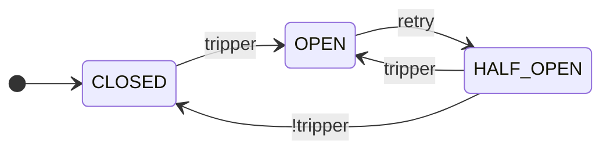

<h1 align="center">Fluxgate</h1>

<p align="center">
  <a href="https://github.com/byExist/fluxgate/actions/workflows/ci.yml"></a>
  <a href="https://pypi.org/project/fluxgate/"></a>
  <a href="https://pypi.org/project/fluxgate/"></a>
  <a href="https://github.com/byExist/fluxgate/blob/master/LICENSE"></a>
</p>

<p align="center">
  A composable <b>Python circuit breaker</b> library — sliding-window failure rate, latency, and consecutive-failure rules.
</p>

<p align="center">
  <a href="README.ko.md">한국어</a>
</p>

---

## Why Fluxgate?

Circuit breakers prevent cascading failures by temporarily blocking calls to unhealthy dependencies. Most existing Python circuit breakers trip on **consecutive failure counts**, which is brittle: a single occasional success resets the counter even when the service is still degraded.

Fluxgate trips on a **failure rate over a sliding window** — the same proven approach Java's [Resilience4j](https://resilience4j.readme.io/) uses — with **latency-aware triggers**, **composable rules** (`&` / `|`), and **gradual recovery** (`RampUp`). Both `CircuitBreaker` (sync) and `AsyncCircuitBreaker` (async) are first-class.

> **Note:** State is process-local and not thread-safe. For concurrency, use `asyncio` + `AsyncCircuitBreaker`, not threading.

## Installation

```bash
pip install fluxgate                  # core, zero dependencies
pip install "fluxgate[prometheus]"    # +PrometheusListener
pip install "fluxgate[slack]"         # +SlackListener
```

## Usage

```python
import httpx
from fluxgate import AsyncCircuitBreaker
from fluxgate.windows import TimeWindow
from fluxgate.trackers import TypeOf
from fluxgate.trippers import MinRequests, FailureRate, SlowRate, FailureStreak
from fluxgate.retries import Backoff
from fluxgate.permits import RampUp
from fluxgate.listeners.log import LogListener

# Protect calls to an external payments API.
payments_cb = AsyncCircuitBreaker(
    window=TimeWindow(size=60),                            # 60-second sliding window
    tracker=TypeOf(httpx.HTTPError),                       # count only HTTP/network errors
    tripper=FailureStreak(5) | (                           # trip on 5 consecutive failures,
        MinRequests(20) & (                                # or, after 20+ requests in the window:
            FailureRate(0.5) |                             #   failure rate above 50%,
            SlowRate(0.3, threshold=1.0)                   #   or 30%+ of calls slower than 1s
        )
    ),
    retry=Backoff(initial=10.0, max_duration=600.0),       # exponential backoff before retrying
    permit=RampUp(initial=0.1, final=1.0, duration=60.0),  # ramp recovery traffic 10% → 100% over 60s
    listeners=[LogListener(name="payments-api")],          # log every state transition
)


@payments_cb
async def check_payment_status(payment_id: str) -> dict:
    async with httpx.AsyncClient(timeout=2.0) as client:
        response = await client.get(f"https://api.example.com/payments/{payment_id}")
        response.raise_for_status()
        return response.json()
```

The same configuration applies to `CircuitBreaker` for sync code. A tripped circuit raises `CallNotPermittedError`, which the caller handles with `try`/`except` or a `fallback=` argument on the decorator.

## How It Works

Fluxgate is a state machine. The core cycle is CLOSED → OPEN → HALF_OPEN:



Three additional states (`metrics_only`, `disabled`, `forced_open`) are documented in [Operational Controls](#operational-controls).

## Components

| Component | Operators | Role | Examples |
|-----------|-----------|------|----------|
| `Window` | — | Track recent calls (count- or time-based) | `CountWindow(100)`, `TimeWindow(60)` |
| `Tracker` | `&` `\|` `~` | Classify which exceptions count as failures | `All()`, `TypeOf(HTTPError)`, `Custom(func)` |
| `Tripper` | `&` `\|` | Decide when to open the circuit | `MinRequests`, `FailureRate`, `SlowRate`, `AvgLatency`, `FailureStreak`, `Closed`/`HalfOpened` |
| `Retry` | — | Trigger `OPEN → HALF_OPEN` | `Cooldown`, `Backoff`, `Always`, `Never` |
| `Permit` | — | Admit calls in `HALF_OPEN` | `All`, `Random(ratio)`, `RampUp(initial, final, duration)` |
| `Listener` | — | React to state transitions | `LogListener`, `PrometheusListener`, `SlackListener` |

`Window`, `Tracker`, `Tripper`, `Retry`, and `Permit` are abstract base classes (`abc.ABC`) with input validation — misconfigurations fail fast at construction time. Subclass to write your own.

`Listener` and `AsyncListener` are defined as `Protocol`s to support user-defined functions or types.

## Operational Controls

Beyond automatic trips, the breaker exposes hooks for safe rollouts and manual control:

- **`cb.metrics_only()`** — shadow mode: collect metrics without ever tripping. Ideal for validating thresholds in production before going live.
- **`cb.force_open()`** / **`cb.disable()`** — manual override during incident response or maintenance.
- **`cb.info()`** — snapshot of state, metrics, and reopen count.
- **`cb.reset()`** — return to CLOSED and clear metrics.

## Documentation

- [Full documentation](https://byExist.github.io/fluxgate/latest/) — concepts, components, examples, API reference
- [Library comparison](https://byExist.github.io/fluxgate/latest/about/comparison/) — design trade-offs against other Python circuit breakers
- [Changelog](https://byExist.github.io/fluxgate/latest/changelog/) — version history and migration guides

## Development

```bash
uv sync --all-extras --all-groups
uv run pytest
```
